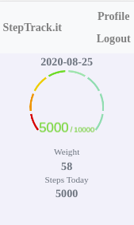
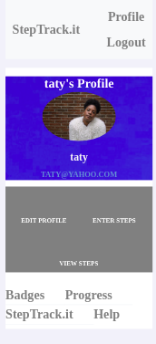
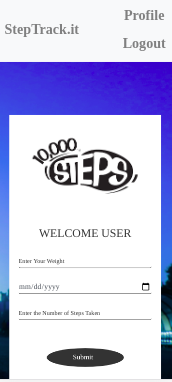

# Steps Tracker

### This is a single page application built with react,redux and rails

#### The app provides a platform where users can track their steps simply by inputting the steps taken each day. Every Input has a time stamp, that way you can track your steps.

## RoR API Endpoint

https://github.com/Datagirlcmr/daily-steps-api

## Screenshots and Walkthrough

https://www.loom.com/share/9b3e28f9973d4148bc7359015e93704e

> To be able to use the app, a user must sign up without which he won't be able to enjoy the full benefits. Attempting to use the app without validation will through errors.

 

> As soon as you register, you will be redirected to your Profile Page. Here the user is presented with the option of either editing their profile or Tracking their steps. 

 

> Choosing to track your steps redirects the user to a form where he is prompted to input his age, steps recorded and a date. Because of the availability of a time stamp, a user can enter their steps as per a day in the past. 

 

> A successfull submission of the steps tracking form redirects the user to an index page displaying all the steps he has entered in the past. Clicking on any of these steps, opens up to more details about that particular input.

 

 

> The remaining pages are the login/signup forms

 

## Built With

- javaScript
- React
- Rails
- Sass
- Redux
- Node js
- Heroku

## Live Demo

[Live Demo Link](https://steps-tracker.herokuapp.com/)

## Getting Started

Here are the steps to follow in order to get this project on your local computer.

### Prerequisites

`node v12.16.3 +`

`npm v6.14.4 +`

### Setup

clone this repo by typing `git clone`

### Install

install the dependacies by typing `npm install`

### Usage

start the local server by running `npm start`

### Deployment

this project is deployed on netlify

to get the deployment build of the code run `npm run build`

### Testing

this project uses jest from testing , to run the tests type `npm test` 

## Authors

👤 **Tresor bireke**

- Github: [@Tresor11](https://github.com/Datagirlcmr)
- Twitter: [@Tbireke](https://twitter.com/SelmaNdi)

## 🤝 Contributing

Contributions, issues and feature requests are welcome!

Feel free to check the [issues page](https://github.com/Datagirlcmr/steps-tracker/issues).

## Show your support

Give a ⭐️ if you like this project!

## Acknowledgments

- Hat tip to anyone whose code was used
- Inspiration
- etc

## 📝 License

This project is [MIT](lic.url) licensed.
